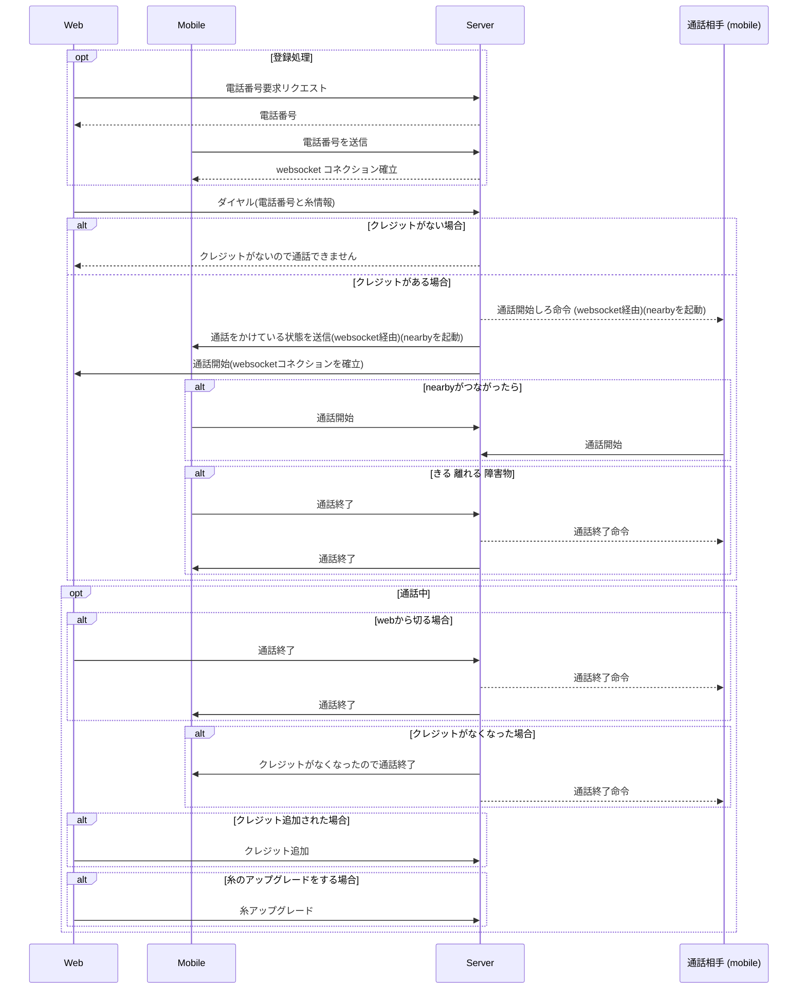
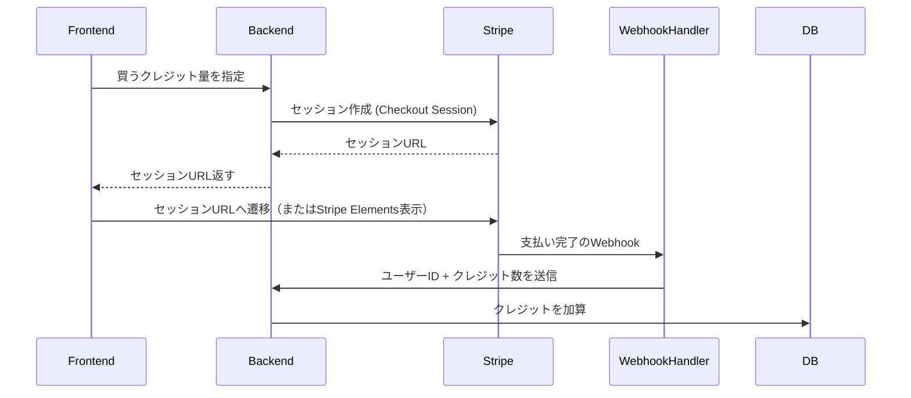
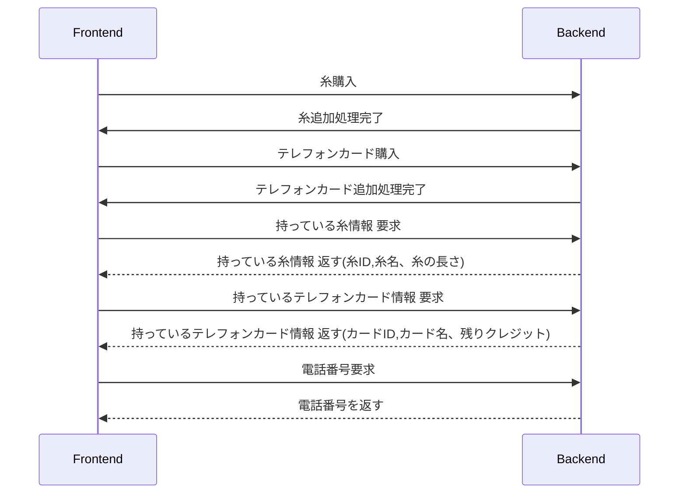
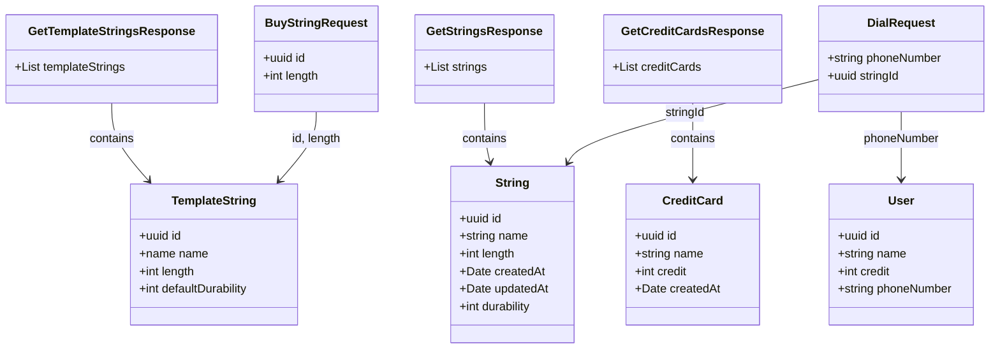

```mermaid
sequenceDiagram

    participant Web
    participant Mobile
    participant Server
    participant peer as 通話相手 (mobile)

    opt 登録処理
        Web->>Server: 電話番号要求リクエスト
        Server-->>Web: 電話番号
        Mobile->>Server: 電話番号を送信
        Server-->>Mobile: websocket コネクション確立
    end

    Web->>Server: ダイヤル(電話番号と糸情報)
    alt クレジットがない場合
        Server-->>Web: クレジットがないので通話できません
    else クレジットがある場合

    Server -->>peer: 通話開始しろ命令 (websocket経由)(nearbyを起動)
    Server->>Mobile: 通話をかけている状態を送信(websocket経由)(nearbyを起動)

    Server ->> Web: 通話開始(websocketコネクションを確立)

    alt nearbyがつながったら
    Mobile->>Server: 通話開始
    peer->>Server: 通話開始
    end
    alt きる 離れる 障害物
    Mobile->>Server: 通話終了
    Server-->>peer: 通話終了命令
    Server->>Mobile: 通話終了
    end
        end


    opt 通話中
    alt webから切る場合
        Web->>Server: 通話終了
        Server-->>peer: 通話終了命令
        Server->>Mobile: 通話終了
    end
    alt クレジットがなくなった場合
        Server->>Mobile: クレジットがなくなったので通話終了
        Server-->>peer: 通話終了命令
        end
    alt クレジット追加された場合
        Web ->>Server: クレジット追加
    end
    alt 糸のアップグレードをする場合
        Web ->>Server: 糸アップグレード
    end
    end


```

```mermaid
sequenceDiagram
    participant Frontend
    participant Backend
    participant Stripe
    participant WebhookHandler

    Frontend->>Backend: 買うクレジット量を指定
    Backend->>Stripe: セッション作成 (Checkout Session)
    Stripe-->>Backend: セッションURL
    Backend-->>Frontend: セッションURL返す
    Frontend->>Stripe: セッションURLへ遷移（またはStripe Elements表示）

    Stripe->>WebhookHandler: 支払い完了のWebhook
    WebhookHandler->>Backend: ユーザーID + クレジット数を送信
    Backend->>DB: クレジットを加算
```

```mermaid
sequenceDiagram
    participant Frontend
    participant Backend

    Frontend->>Backend: 糸購入
    Backend->>Frontend: 糸追加処理完了
    Frontend->>Backend: テレフォンカード購入
    Backend->>Frontend: テレフォンカード追加処理完了

    Frontend->>Backend: 持っている糸情報 要求
    Backend-->>Frontend: 持っている糸情報 返す(糸ID,糸名、糸の長さ)
    Frontend->>Backend: 持っているテレフォンカード情報 要求
    Backend-->>Frontend: 持っているテレフォンカード情報 返す(カードID,カード名、残りクレジット)

    Frontend->>Backend: 電話番号要求
    Backend-->>Frontend: 電話番号を返す

```

```mermaid
classDiagram

    class TemplateString {
      +uuid id
      +name name
      +int length
      +int defaultDurability
    }

    class GetTemplateStringsResponse {
        +List<TemplateString> templateStrings
    }

    GetTemplateStringsResponse --> TemplateString : contains

    class String {
        +uuid id
        +string name
        +int length
        +Date createdAt
        +Date updatedAt
        +int durability
    }

    class GetStringsResponse {
        +List<String> strings
    }

    GetStringsResponse --> String : contains

    class CreditCard {
        +uuid id
        +string name
        +int credit
        +Date createdAt
    }

    class GetCreditCardsResponse {
        +List<CreditCard> creditCards
    }
    GetCreditCardsResponse --> CreditCard : contains


    class DialRequest {
        +string phoneNumber
        +uuid stringId
    }
    DialRequest --> User : phoneNumber
    DialRequest --> String : stringId

    class BuyStringRequest {
        +uuid id
        +int length
    }
    BuyStringRequest --> TemplateString : id, length

    class User {
        +uuid id
        +string name
        +int credit
        +string phoneNumber
    }
```
